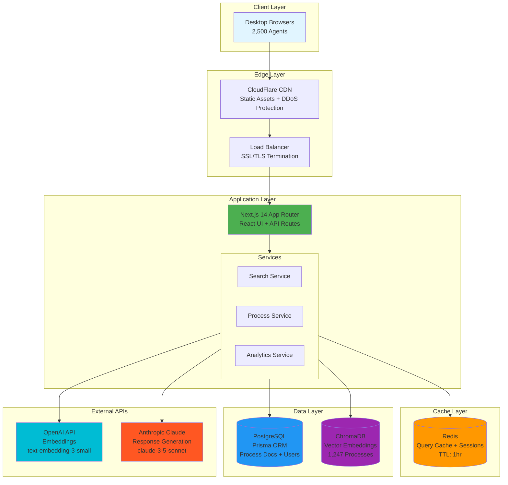
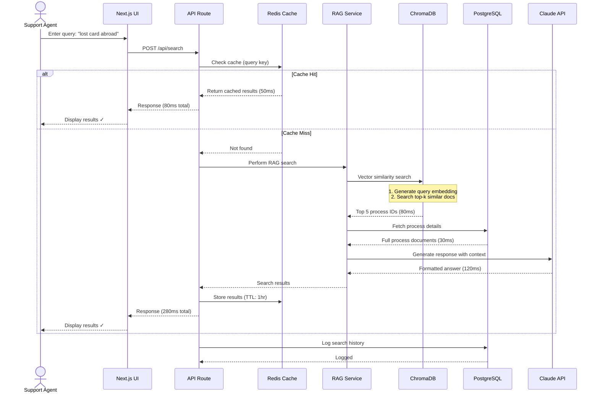
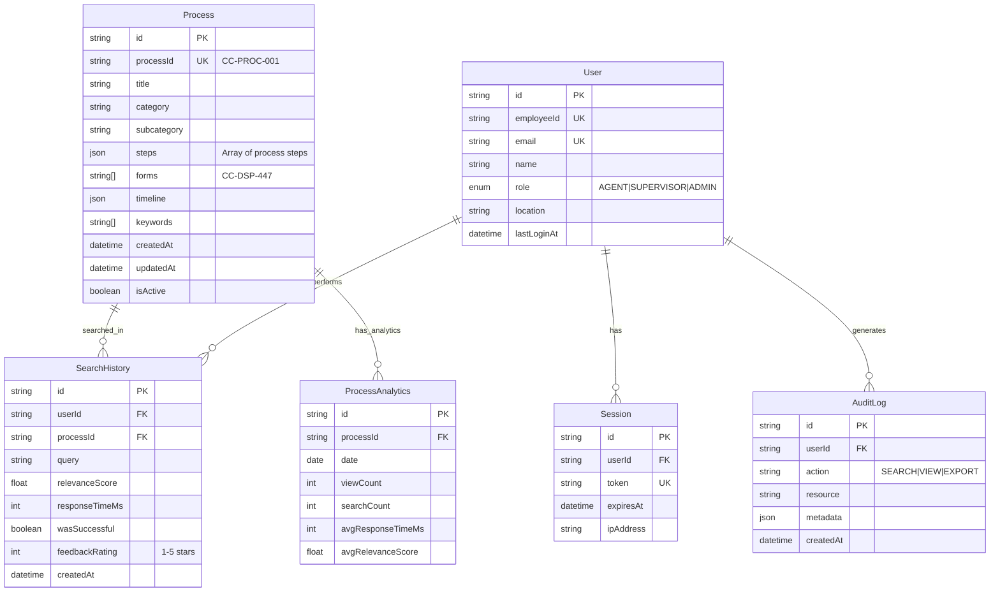
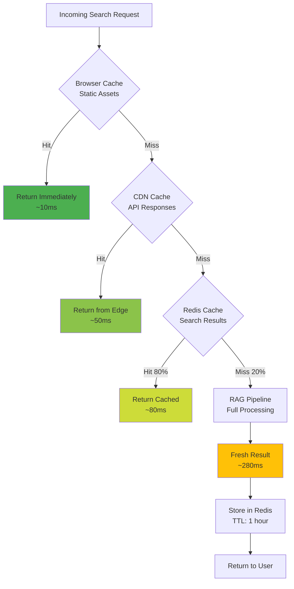
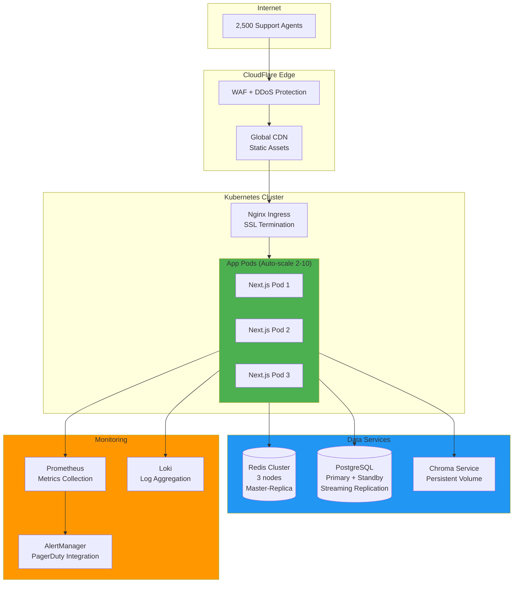
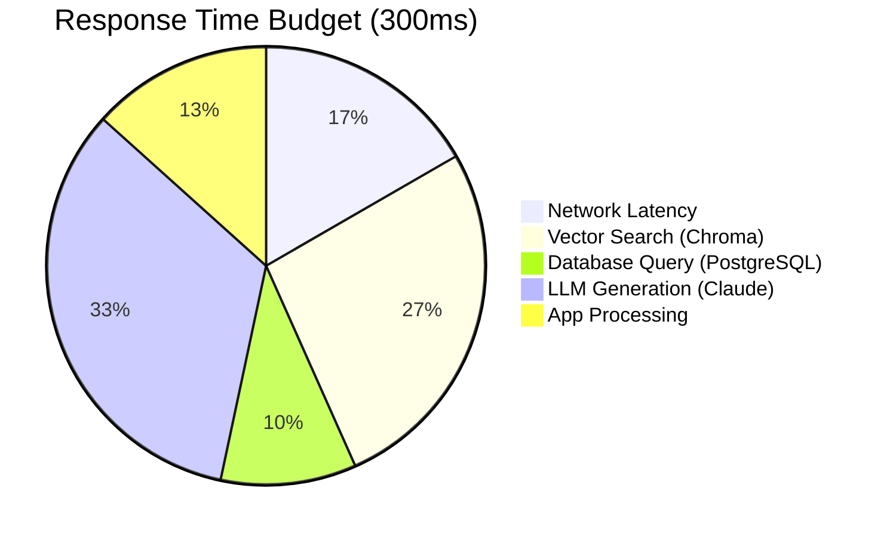
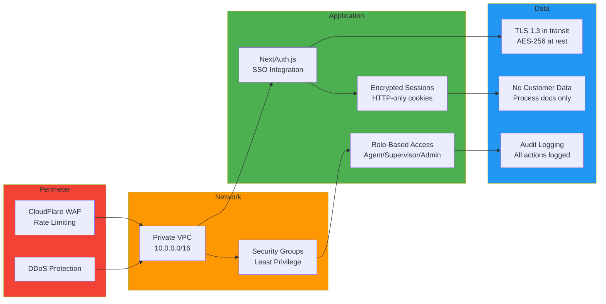
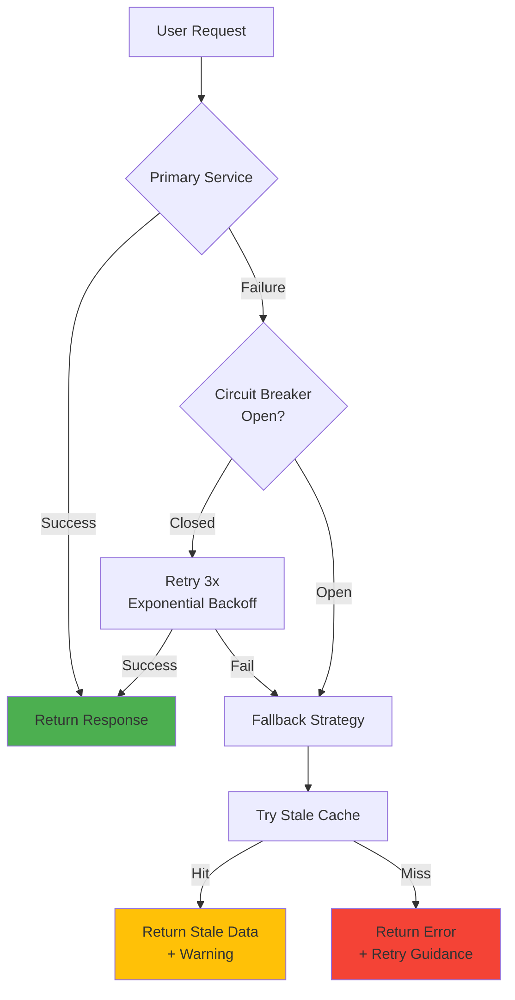
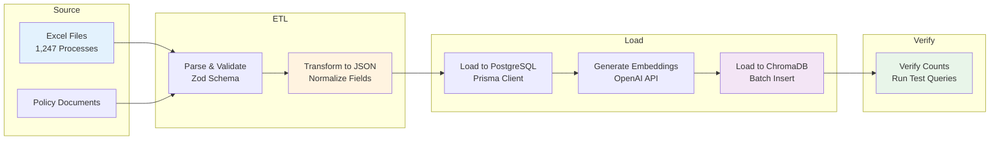

# Production Architecture Design
## Credit Card RAG Application - Next.js + Prisma + PostgreSQL + Chroma

---

## 1. System Architecture Overview



---

## 2. Search Request Dataflow



**Target Performance:** 95% of requests < 300ms

---

## 3. RAG Pipeline Architecture

```mermaid
graph LR
    subgraph Input
        Query["User Query<br/>lost card abroad"]
    end

    subgraph Preprocessing
        Clean["Clean & Normalize<br/>lowercase, trim"]
        Expand["Expand Abbreviations<br/>CC to Credit Card"]
    end

    subgraph Embedding
        Embed["OpenAI Embedding API<br/>text-embedding-3-small<br/>1536 dimensions"]
    end

    subgraph Retrieval
        Chroma[("ChromaDB<br/>Vector Search")]
        Filter["Filter by Category<br/>Apply metadata filters"]
        Rerank["Re-rank Results<br/>Business rules"]
    end

    subgraph Augmentation
        Fetch["Fetch from PostgreSQL<br/>Full process details"]
        Context["Build Context<br/>Steps + Forms + Codes"]
    end

    subgraph Generation
        LLM["Claude Sonnet<br/>Temperature: 0.3"]
        Format["Format Response<br/>Step-by-step instructions"]
    end

    subgraph Output
        Result["Structured Response<br/>+ Metadata"]
    end

    Query --> Clean --> Expand --> Embed
    Embed --> Chroma --> Filter --> Rerank
    Rerank --> Fetch --> Context --> LLM --> Format --> Result

    style Query fill:#e3f2fd
    style Embed fill:#fff3e0
    style Chroma fill:#f3e5f5
    style LLM fill:#fce4ec
    style Result fill:#e8f5e9
```



---

## 4. Database Schema (Prisma)



---

## 5. Caching Strategy



**Cache Tiers:**
1. **Browser**: Static assets (indefinite)
2. **CDN**: API responses for common queries (5 min)
3. **Redis**: Search results + process details (1 hour)
4. **Application**: Connection pools, Prisma client

---

## 6. Deployment Architecture



---

## 7. Technology Stack

| Layer | Technology | Purpose | Rationale |
|-------|-----------|---------|-----------|
| **Frontend** | Next.js 14 + React | UI + API Routes | Full-stack framework, excellent DX |
| **Backend** | Next.js API Routes | REST endpoints | Same codebase, TypeScript end-to-end |
| **ORM** | Prisma | Database access | Type-safe, migrations, great DX |
| **Database** | PostgreSQL 15 | Process docs, users | ACID compliance, reliability |
| **Vector DB** | ChromaDB | Embeddings | Open-source, easy setup, good for POC |
| **Cache** | Redis | Query cache | Sub-millisecond latency |
| **Embeddings** | OpenAI text-embedding-3-small | Vector generation | Fast, cheap ($0.02/1M tokens) |
| **LLM** | Claude 3.5 Sonnet | Response generation | Best reasoning, accurate |
| **Container** | Docker + Kubernetes | Orchestration | Scalability, high availability |
| **Monitoring** | Prometheus + Grafana | Metrics & alerting | Industry standard |

---

## 8. Performance Budget

### Response Time Breakdown (300ms target)



### Optimization Strategies

1. **Caching**: 80% cache hit rate → 80% of queries < 100ms
2. **Connection Pooling**: Reuse DB/Redis connections (50 max)
3. **Query Optimization**: Database indexes on `category`, `processId`, `userId`
4. **Parallel Execution**: Fetch from DB + LLM simultaneously where possible
5. **Pre-warming**: Cache top 100 queries on startup

---

## 9. Security Architecture



---

## 10. Scalability & High Availability

### Horizontal Scaling

- **App Layer**: Auto-scale Next.js pods (2-10 based on CPU/memory)
- **Database**: PostgreSQL read replicas for analytics queries
- **Cache**: Redis cluster with 3 nodes (master + 2 replicas)
- **Vector DB**: Chroma with persistent volumes (manual scale)

### Failure Handling



**SLA Target:** 99.9% uptime = 43 minutes downtime/month

---

## 11. Data Ingestion Pipeline



**Ingestion Script:** `npm run ingest:documents`

---

## 12. Monitoring & Observability

### Key Metrics

| Metric | Target | Alert Threshold |
|--------|--------|----------------|
| Response Time (p95) | < 300ms | > 500ms |
| Response Time (p99) | < 500ms | > 1000ms |
| Error Rate | < 0.1% | > 1% |
| Cache Hit Rate | > 80% | < 60% |
| Concurrent Users | 2,500 peak | > 3,000 |
| Database Connections | < 40 | > 45 |
| Chroma Latency | < 100ms | > 200ms |

### Health Checks

```typescript
// Liveness: Is service running?
GET /api/health/live

// Readiness: Can service handle traffic?
GET /api/health/ready
```

---

## 13. Disaster Recovery

**Backup Strategy:**
- **PostgreSQL**: Daily automated backups (30-day retention)
- **Redis**: AOF persistence (append-only file)
- **ChromaDB**: Weekly vector DB snapshots
- **Application**: Immutable Docker images

**Recovery Time Objective (RTO):** 1 hour
**Recovery Point Objective (RPO):** 24 hours

---

## Summary

This architecture delivers:
- ✅ **<300ms response time** (95th percentile) via aggressive caching
- ✅ **2,500 concurrent users** via horizontal scaling
- ✅ **99.9% uptime** via redundancy and failover
- ✅ **Type-safe development** via TypeScript + Prisma
- ✅ **Cost efficiency** via open-source stack (Chroma, PostgreSQL)
- ⚠️ **Trade-off**: Chroma lacks enterprise features; plan migration to Pinecone if scaling beyond 5,000 users

**Next Steps:** Review IMPLEMENTATION_GUIDE.md for setup instructions.
